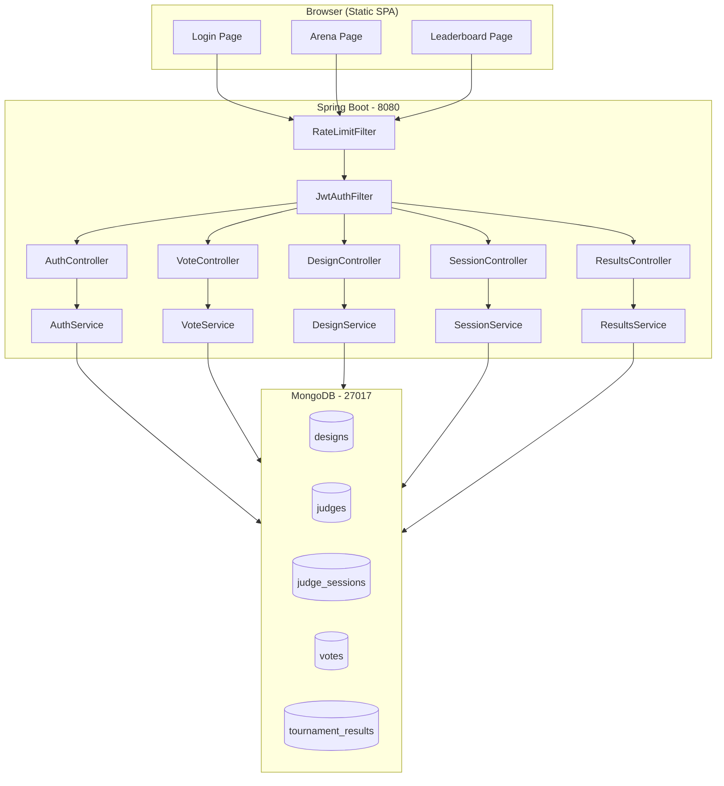
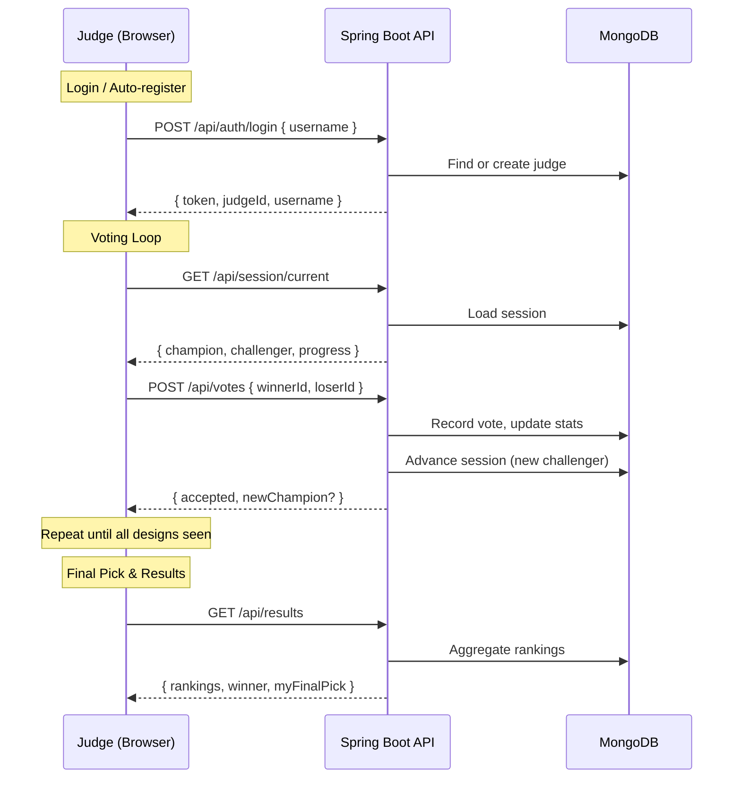

# Design Duel Championship

A "King of the Hill" tournament-style voting platform where judges compare designs head-to-head to crown a champion.

## Tech Stack

| Layer    | Technology                           |
|----------|--------------------------------------|
| Backend  | Java 17, Spring Boot 4.0.6           |
| Database | MongoDB                              |
| Auth     | JWT (HMAC-SHA), stateless            |
| Frontend | Vanilla HTML / CSS / JS (static SPA) |
| Build    | Maven                                |

## Architecture



## Tournament Flow



## Getting Started

### Prerequisites

- Java 17+
- MongoDB
- Maven

### Run

```bash
mvn spring-boot:run
```

Opens at **http://localhost:8080**. On first startup, 20 fantasy-themed designs are seeded automatically.

### Configuration

All settings are configurable via environment variables (see `application.yml`):

| Variable                      | Default                                 | Description                      |
|-------------------------------|-----------------------------------------|----------------------------------|
| `MONGODB_URI`                 | `mongodb://localhost:27017/design-duel` | MongoDB connection string        |
| `JWT_SECRET`                  | (built-in fallback)                     | HMAC-SHA key for JWT signing     |
| `CORS_ORIGINS`                | `*`                                     | Allowed CORS origins             |
| `RATE_LIMIT_ENABLED`          | `true`                                  | Enable/disable rate limiting     |
| `RATE_LIMIT_CAPACITY`         | `30`                                    | Token bucket capacity            |
| `RATE_LIMIT_REFILL`           | `20`                                    | Tokens refilled per minute       |
| `USERNAME_VALIDATION_ENABLED` | `false`                                 | Enable username regex validation |
| `USERNAME_PATTERN`            | `^[a-z0-9._-]+$`                        | Username validation regex        |

## How It Works

- **Auto-registration**: Judges are created on first login — no admin pre-creation needed.
- **King of the Hill**: A champion design faces challengers. Win keeps the crown; loss promotes the challenger.
- **Progress**: Each judge sees every design once. When all are seen, their current champion becomes their **final pick**.
- **Leaderboard**: Rankings are computed by final pick count (descending), then win rate.
- **Anti-abuse**: Token-bucket rate limiter (30 req burst, 20/min refill) protects the API.
